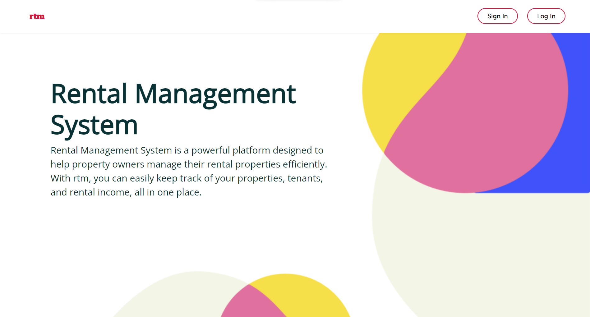

# Rental Management System

A huge number of rental property owners find it difficult and exhausting manually keeping track of all their rentals, they encounter difficulty keeping track of empty housing, payment, scheduling house repairs among other things.

The rental management system will offer solutions to the above problems.

# Setup Requirements
- Visual Studio Code, see [here](https://code.visualstudio.com/)
- Windows Subsystem for Linux (WSL), details [here](https://learn.microsoft.com/en-us/windows/wsl/install)
- Git
- Github and GitHub pages [deployment](https://eugenemrg.github.io/News-Sources/)
- Node.js (includes npm), see [here](https://nodejs.org/en)
- Python

# Installation
To run the Rental Management App locally:

- Clone/Download the repository.
- `cd` into `client` and install the required dependencies using `npm install.`
- Start the development server using `npm start.`
- Open your browser and navigate to `http://localhost:3000` or to the link with any other available port assigned when starting the server
- The app should run on any modern web browser with JavaScript enabled
- To start the flask app `cd` into `server`, run `pipenv install` then `flask run` or `python app.py` to test the API

### Deployment links

Website Link: https://rental-management-system-ten.vercel.app/
Api Link: https://rmt-5zqu.onrender.com/

# Screenshots

Landing page and Log In page

.png)

Owner Dashboard

.png)

Owner Properties

.png)

Adding a new property

.png)

Updating property details

.png)

Units/houses in properties

.png)

New house/unit

.png)

House Issues

.png)

### API endpoints

API documentation to be added after update

#### Trial Credentials

User email: pmosley@example.com    
Password:   9%1*T6As

# Dependencies
The project has the following dependencies:

- React - A JavaScript library for building user interfaces.
- gh-pages - Deploys React application to GitHub pages
- React Router - Routes links to give React a multi-page experience
- Flask - For the API

# Languages and Tools
- JavaScript
- React (React Router, React Bootstrap, React Auth Kit)
- Python
- Flask

# Contributing
Contributions are welcome. Reach out to any of the authors or our community to get on board.

# Author(s)
This is a group project created by:

- [Eugene Aduogo](https://github.com/eugenemrg/)
- Misheck Wachiuri
- [Victor Oroo](https://github.com/VictorOroo)
- Genevive Opondo
- Brian Odhiambo

# License
Rental Management System. An automated systems for owners of rental properties to manage their properties

Copyright (C) 2023

Licensed under GNUv3. See [license](/LICENSE)

This program is free software: you can redistribute it and/or modify
it under the terms of the GNU General Public License as published by
the Free Software Foundation, either version 3 of the License, or
(at your option) any later version.

This program is distributed in the hope that it will be useful,
but WITHOUT ANY WARRANTY; without even the implied warranty of
MERCHANTABILITY or FITNESS FOR A PARTICULAR PURPOSE.  See the
GNU General Public License for more details.

You should have received a copy of the GNU General Public License
along with this program.  If not, see <https://www.gnu.org/licenses/>.

# Acknowledgements
The Rental Management System is created for learning purposes mainly using React and Flask alongside many other open source tools.